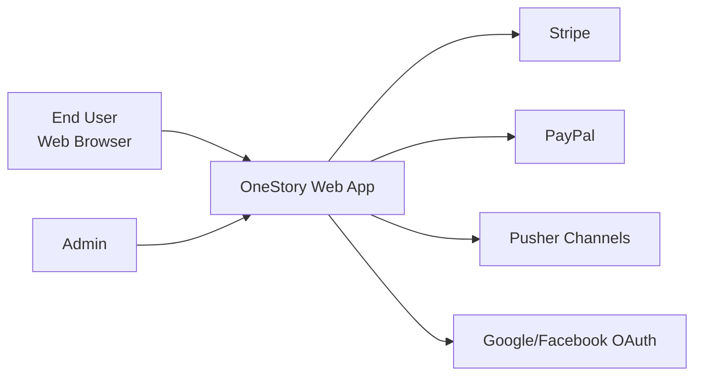
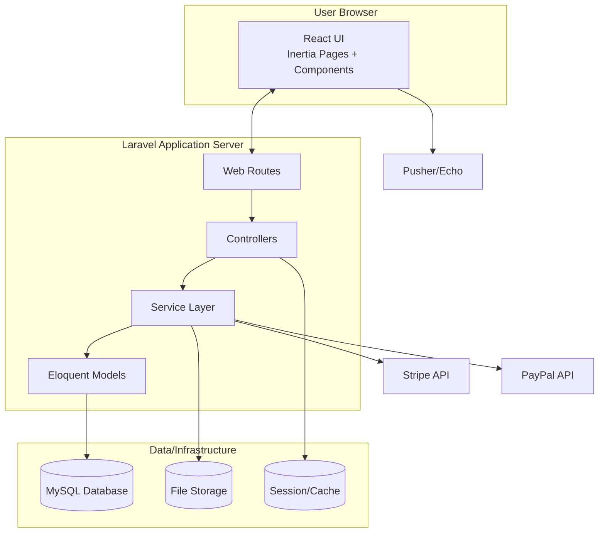
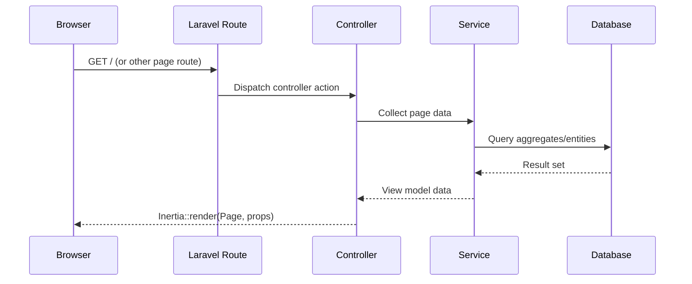
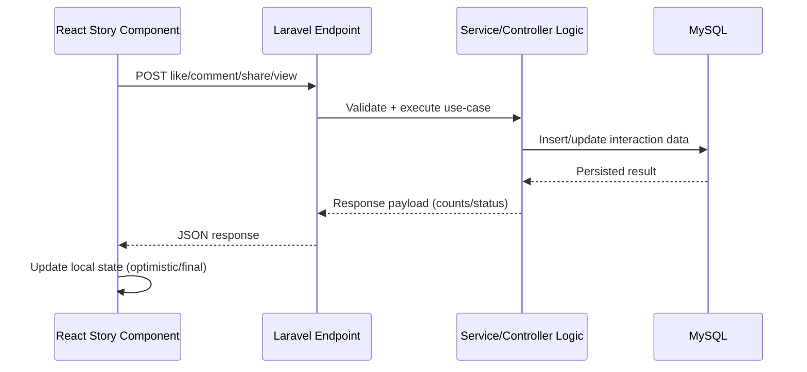

# OneStory System Architecture

## 1) System Overview

OneStory is a Laravel + Inertia + React platform for publishing and interacting with personal stories (video/image/audio), with social interactions (likes/comments/shares/follows), gifting, and wallet-based transactions.

- **Backend:** Laravel 11 (PHP), MVC + service layer
- **Frontend:** React 18 rendered through Inertia.js
- **Build:** Vite
- **Primary DB:** MySQL via Eloquent ORM
- **Storage:** Local public files and cloud-capable filesystem
- **Integrations:** Stripe, PayPal, Pusher/Echo, OAuth providers

## 2) C4-Style Context (Level 1)

## 3) Container View (Level 2)

## 4) Application Architecture

### Backend (Laravel)

- `routes/web.php` is the primary route surface (page routes + action endpoints).
- Controllers in `app/Http/Controllers` handle HTTP concerns and delegate business logic.
- Service contracts in `app/Contracts/Services` and implementations in `app/Services`.
- Models in `app/Models` represent domain entities (`User`, `Story`, `Comment`, `StoryLike`, `StoryView`, wallet/payment entities).
- Middleware in `app/Http/Middleware` handles auth, role checks, Inertia shared props, and request-level policies.

### Frontend (React + Inertia)

- Entry point: `resources/js/app.jsx`
- Page layer: `resources/js/Pages/*` (route-aligned page components)
- Feature/shared components: `resources/js/Components/*`
- Shared app state:
  - Contexts: `resources/js/Contexts/*` (sound, mute, editor redirection)
  - Hooks: `resources/js/Hooks/*` (story like state, device checks, media helpers)
- Utility layer: `resources/js/Utils/*` (analytics, caches, media conversion)
- Styling: Tailwind + custom CSS under `resources/css/*`

## 5) Key Runtime Flows

### A) Page Rendering (Inertia)

### B) Story Interaction (Like/Comment/Share/View)

### C) Authentication + Authorization

- Session-based authentication (Laravel auth stack).
- Social login through OAuth controllers (Google/Facebook).
- Route protection via middleware groups (`auth`, role middleware).
- Admin routes isolated under dedicated route groups.

## 6) Domain Modules

- **Identity & Profiles:** registration/login, profile management, follow relationships.
- **Story Domain:** create/publish stories, likes, comments, shares, views, status handling.
- **Media Domain:** upload/playback handling, draft/edit workflows, audio recording support.
- **Monetization Domain:** wallet, gifts, top-ups, withdrawals, donations, webhook reconciliation.
- **Admin Domain:** content moderation, CMS sections, platform settings, financial oversight.

## 7) Data Layer

Core persistence is relational and modeled through Eloquent:

- **User-centric:** users, follows, profile-related entities
- **Story-centric:** stories, story_likes, comments, story_views
- **Finance-centric:** wallets, transactions, gifts, deposits/withdrawals
- **Content-centric:** static pages, homepage sections, moderation/status tables

## 8) Integration Points

- **Stripe/PayPal:** payment processing and webhook callbacks.
- **Pusher + Echo:** real-time messaging/notification patterns.
- **OAuth providers:** external identity.
- **Media tooling:** frontend media processing plus server-side storage pipelines.

## 9) Operational Notes

- Build pipeline: Vite (`npm run dev`, `npm run build`).
- Backend runtime: standard Laravel app lifecycle (`php artisan` commands, queue/scheduler ready pattern).
- Design approach: monolith application with clear modular boundaries by domain/service.

## 10) Suggested Next Architecture Artifacts

- **ERD:** entity relationship diagram for story + wallet modules.
- **API map:** route-to-controller-to-service catalog for critical endpoints.
- **Deployment diagram:** web/app/queue/cache/storage topology for production.

